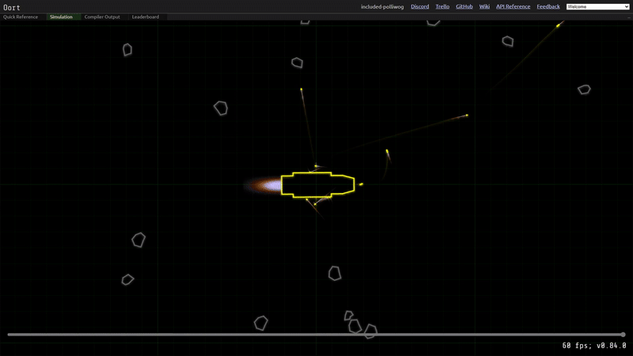

#  THE CAMPER KILLER — Fighter Duel (Oort.rs)
<div align="center">
  
</div>




---

## Introduction

**Projet HEPIA ISC — Université d'automne Rust 2024**

> IA de combat spatiale 2D développée en Rust pour la plateforme [oort.rs](https://oort.rs).
> L'objectif : détruire le vaisseau adverse contrôlé par le code d'une autre équipe.

Notre vaisseau, **THE CAMPER KILLER**, a atteint la **demi-finale** du tournoi face à une quinzaine d'équipes concurrentes. 🔥

---

## Auteurs

* **Yassin EL HAKOUNI**
* **Riad HYSENI**
* **Navid ELMI**

> Groupe : *Oh Rust Is* (ISC 2e année – HEPIA)

---

## Contexte

Chaque équipe devait coder son vaisseau en Rust pour l'affrontement sur la plateforme **oort.rs**.
Les combats se déroulaient sur une grille 2D : le dernier vaisseau en vie gagnait la manche.

**Contraintes principales :**

* Les vaisseaux utilisent des **armes et missiles** disponibles via l'API Oort.
* Les missiles peuvent être **guidés par radar** ou **radio**.
* Les tirs doivent être précis, calculés selon la **vitesse et position future** de l'adversaire.

**Notre choix stratégique :**
✔️ Pas de radio (pour éviter le brouillage adverse)
✔️ Radar étroit + balayage continu
✔️ Prédiction de tir épurée et constante
✔️ Barrage de missiles en approche continue

---

## Code principal

Fichier : [`src/the_camper_killer.rs`](src/the_camper_killer.rs)

```rust
/*
*   Auteurs : "HYSENI Riad", "EL HAKOUNI Yassin" & El Magnifico "ELMI Navid"
*   Notre vaisseau fighter : THE CAMPER KILLER
*   DISCLAIMER: On n'utilise pas la radio par stratégie afin de ne pas se faire brouiller nos missiles
*               A la place on utilise les radars sur les missiles
*/
```

---

## Système de tir et prédiction

* Calcul de la **position future de l'ennemi** en fonction de sa vitesse.
* Ajustement de la trajectoire et **tir en continu**.
* Les balles rapides (∼1000 m/s) sont calibrées pour anticiper le mouvement adverse.

```rust
fn predict_target_position(enemy_position: Vec2, enemy_velocity: Vec2) -> Vec2 {
    let future_position = enemy_position + enemy_velocity * 0.005;
    let bullet_time_to_target = (future_position - position()).length() / BULLET_SPEED;
    future_position + enemy_velocity * bullet_time_to_target * 0.005
}
```

---

## Stratégie missiles

* Chaque missile utilise **son propre radar** (pas de dépendance radio).
* Ajustement constant vers la cible détectée.
* Explosion automatique si à moins de `200m`.

```rust
if distance_to_target < EXPLOSION_RANGE {
    explode();
}
```

---

## 🎬 Démonstration

<p align="center">
<a href="https://synloop.github.io/oort-fighter-camper-killer/demo.html" target="_blank">🎥 Ouvrir la page de démo</a>
</p>


---

## Tester le code par vous même

Pour cela rendez-vous sur [oort.rs](https://oort.rs).
En haut à droite au lieu de Welcome, rendez-vous sur "Tournament > Fighter Duel" puis collez le code dans la partie gauche "Editor (Player)".
Si vous ne voyez pas la partie gauche, il suffit de cliquer sur le tout petit bouton tout en haut à droite pour déplier la section.
Une fois le code collé, cliquez sur le bouton d'exécution de la simulation.

Ensuite, il ne reste plus qu'à admirer le vaisseau violet ennemi se faire abattre !

---

## Diaporama

Voir la présentation de notre code et de notre stratégie :

📄 [slides/presentation_Oh_Rust_Is.pdf](slides/presentation_Oh_Rust_Is.pdf)

---

## 🏆 Résultats

* Tournoi interne HEPIA (2024) diffusé sur Twitch.
* **Classement : Demi-finale** sur une quinzaine d'équipes.
* **Classement mondial sur le site : 33èmes**.
* **Note finale : 5.5 / 6** (code + présentation).

---

## Pistes d'amélioration

* Navigation proportionnelle pour les missiles.
* Radar adaptatif selon la distance.
* Tir évasif (pour éviter les collisions directes).

---

## Licence

Ce projet est distribué sous licence **MIT**.
Consultez le fichier [LICENSE](LICENSE) pour plus de détails.

---

© 2024 HEPIA ISC — Projet Rust : *THE CAMPER KILLER*


